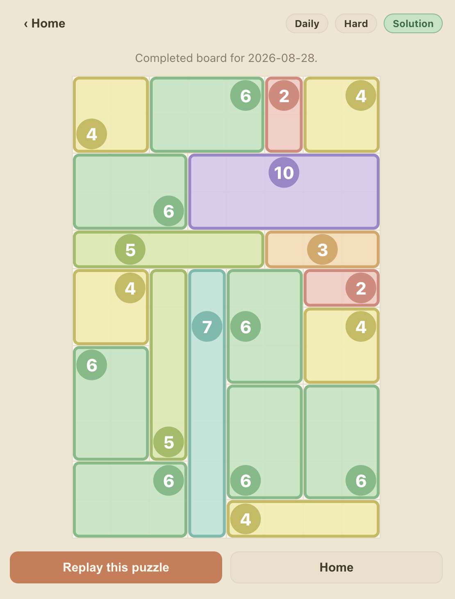

# inboxes

I was enjoying The Economist's daily "inboxes" game but wanted a few more features so I (claude) made this browser-based recreation of the game with unlimited auto-generated puzzles, a daily challenge, and personal stats.

## ▶️ Play

**[Play inboxes →](https://matthewedwarddavidson.github.io/inboxes/)**

The game is [Shikaku](https://en.wikipedia.org/wiki/Shikaku): partition the
8×12 grid into rectangles so each contains exactly one number equal to its area.

<p align="center">
  
</p>

## How puzzles are generated

Every puzzle is produced deterministically from a numeric **seed**. The engine
is a pure function of that seed: it recursively splits the grid into
rectangles, places one clue per rectangle, and verifies the clue set has a
unique solution — retrying with new sub-seeds until it does. The same seed
always yields the exact same puzzle.

This keeps things simple and serverless:

- The **daily challenge** derives its seed (and difficulty) from the UTC date,
  so everyone plays the same puzzle each day and past days can be revisited
  without storing any puzzle data.
- **Free play** just picks a random seed, giving an effectively unlimited
  supply of puzzles.

## Project layout

- `src/engine/` — pure, DOM-free game logic: puzzle generation, solver
  (uniqueness verification), rules/validation, scoring, and the daily puzzle.
- `src/store/` — Zustand game state plus IndexedDB persistence and stats.
- `src/ui/` — React UI: home, board, stats, and settings screens.

See [DESIGN.md](DESIGN.md) for the design and build plan.

## Local development

<details>
<summary>Running the project locally</summary>

```sh
make start      # install deps (if needed) and launch the dev server
```

Then open http://localhost:5173/.

Other commands:

```sh
make test       # run the test suite
make build      # type-check and build the production bundle
make preview    # serve the production build
make typecheck  # run the TypeScript type checker
make clean      # remove node_modules and dist
make help       # list all commands
```

</details>
